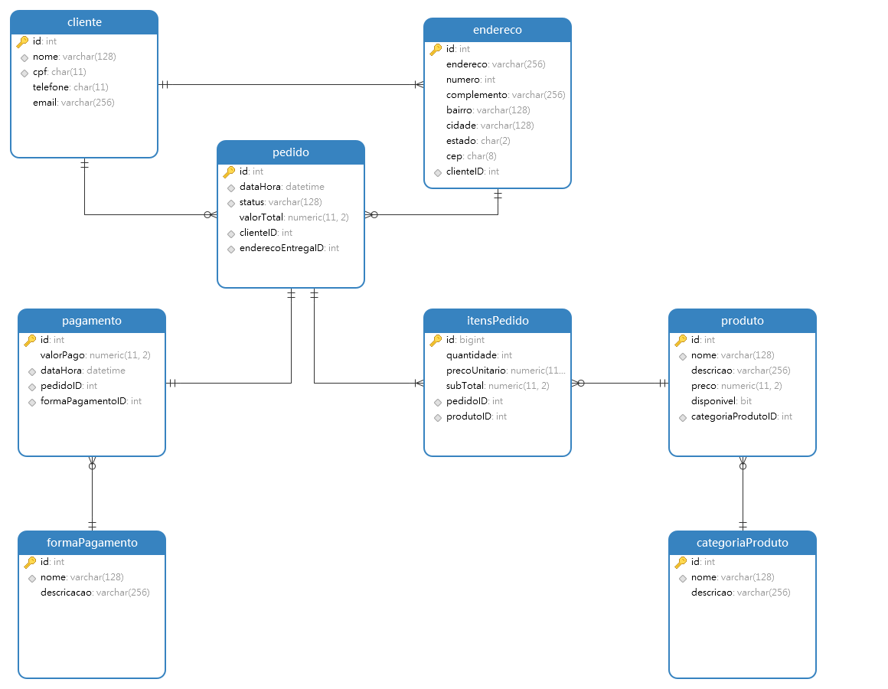

<div style="text-align:center">

# 🍕 PedeAí

**Backend de Delivery**

[](#)
[](#)
[](#)
[](#)
[](#)
[](#)
[](#)

</div>

---

## ℹ️ ᐧ Sobre

Uma API REST desenvolvida com Spring Boot como projeto de estudos. A ideia é simular o backend de um sistema de delivery simples, aplicando boas práticas de DDD em Java.

## 🗂️ ᐧ Diagrama Entidade-Relacionamento


## 📃 ᐧ Documentação da API
A documentação interativa do Swagger fica disponível em:

```
http://localhost:8080/swagger-ui/index.html#/
```

---